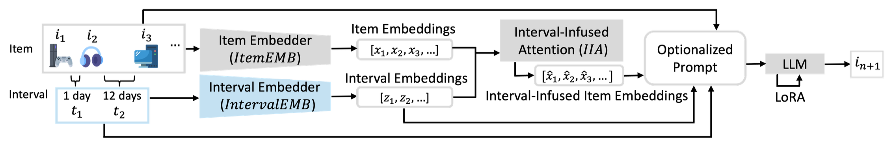

# Not Just What, But When: Integrating Irregular Intervals to LLM for Sequential Recommendation
<a href="https://www.arxiv.org/abs/2507.23209" target="_blank">
    
</a>

This repo contains an official implementation of [Not Just What, But When: Integrating Irregular Intervals to LLM for Sequential Recommendation](https://www.arxiv.org/abs/2507.23209) by Wei-Wei Du, Takuma Udagawa, Kei Tateno, accepted at [RecSys2025](https://recsys.acm.org/recsys25/).

## Overview
Time intervals between purchasing items are a crucial factor in sequential recommendation tasks, whereas existing approaches focus on item sequences and often overlook by assuming the intervals between items are static. However, dynamic intervals serve as a dimension that describes user profiling on not only the history within a user but also different users with the same item history. In this work, we propose **IntervalLLM**, a novel framework that integrates interval information into LLM and incorporates the novel interval-infused attention to jointly consider information of items and intervals. Furthermore, unlike prior studies that address the cold-start scenario only from the perspectives of users and items, we introduce a new viewpoint: **the interval perspective** to serve as an additional metric for evaluating recommendation methods on the warm and cold scenarios. Extensive experiments on 3 benchmarks with both traditional- and LLM-based baselines demonstrate that our IntervalLLM achieves not only 4.4% improvements in average but also the best-performing warm and cold scenarios across all users, items, and the proposed interval perspectives. In addition, we observe that the cold scenario from the interval perspective experiences the most significant performance drop among all recommendation methods. **This finding underscores the necessity of further research on interval-based cold challenges and our integration of interval information in the realm of sequential recommendation tasks.**



## Running the code
```python
python3.12 codes/main.py
```

## Contact
For any question about the paper and code, feel free to contact: Weiwei.Du@sony.com

## Licence
This software is released under the Apache 2.0 License, see LICENSE for the detail.

## Citation
If you found this repository is relevant or useful to your research, please consider citing our paper:
```
@article{du2025not,
  title={Not Just What, But When: Integrating Irregular Intervals to LLM for Sequential Recommendation},
  author={Du, Wei-Wei and Udagawa, Takuma and Tateno, Kei},
  journal={arXiv preprint arXiv:2507.23209},
  year={2025}
}
```
